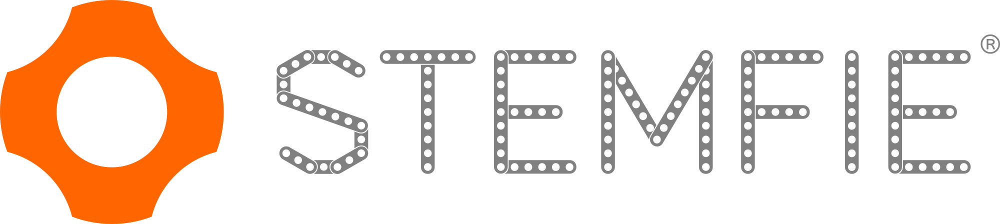
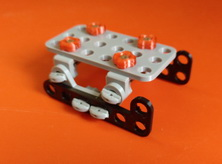
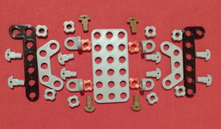
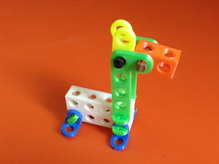
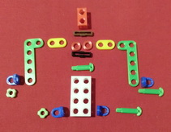
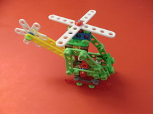
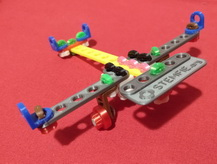
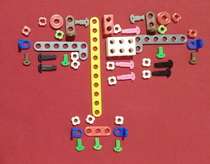

# Models-Stemfie  

Toys models with STEMFIE compability

Models de joguines fetes amb peces amb compatibilitat STEMFIE. 

Realitzades per [Jordi Mayné](https://github.com/maynej) des de Mechatronic Study 

STEMFIE es un projecte de construcció lliure, que s'imprimeix en 3D (http://stemfie.org) 

Pretén facilitar la construcció de nous models amb creativitat. 

## Suports 3D
  
Descripció         | Imatge          | Arxius     | Documentació    
------------- | ------------- | ------------- | -------------
Patinet |  | [Patinet STL](https://github.com/maynej/Models-Stemfie/Patinet/STL) | [Patinet DOC](https://github.com/maynej/Models-Stemfie/Patinet/DOC)
Trineu |  | [Trineu STL](https://github.com/maynej/Models-Stemfie/Trineu/STL) | [Trineu DOC](https://github.com/maynej/Models-Stemfie/Trineu/DOC)
Llama |  | [Llama STL](https://github.com/maynej/Models-Stemfie/Llama/STL) | [Llama DOC](https://github.com/maynej/Models-Stemfie/Llama/DOC)
Helicòpter |  | [Helicopter STL](https://github.com/maynej/Models-Stemfie/Helicopter/STL) | [Helicopter DOC](https://github.com/maynej/Models-Stemfie/Helicopter/DOC)
Avió |  | [Avio STL](https://github.com/maynej/Models-Stemfie/Avio/STL) | [Avio DOC](https://github.com/maynej/Models-Stemfie/Avio/DOC)

## Llicència

Creative Commons Attribution-NoComercial-ShareAlike 4.0 International (CC BY-NC-SA 4.0)  
